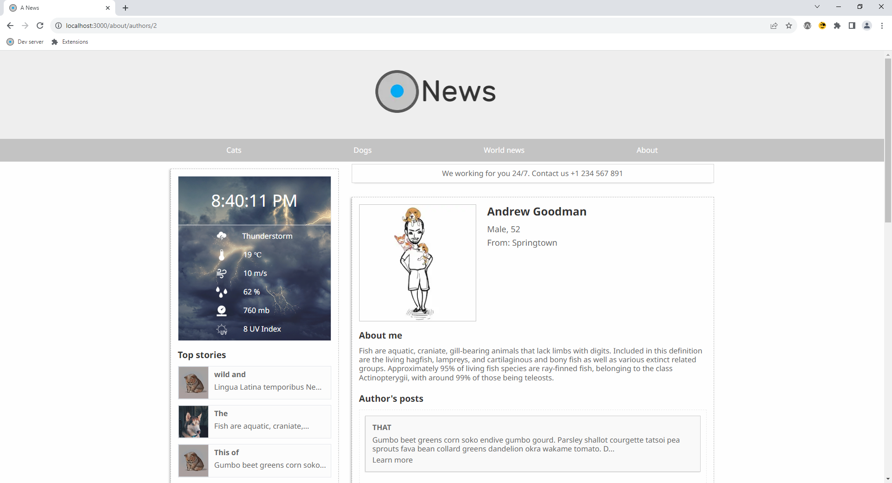

# News A
## :uk: English
__Description:__ News website

__Deployed project:__ http://news-a.alexander-portfolio-and-cv.com

__Used technologies:__

- Typescript
- React
- React hooks
- React server components
- Next.js (app router)
- Tailwind
- Adaptive-responsive design
- Flex layout
- Formik, Yup
- Axios
- SWR
- Express
- PostgreSQL

__About project:__ News website with information about authors, comments, reactions and small weather widget. It's my first website written on new Next.js app router. Initially, I didn't plan to publish it, but it turned out to be quit good, so I decided, why not. TailwindCSS was used for styling. Website also has api written on Node.js/Express. PostgreSQL used as data storage.

## :ru: Русский
__Описание:__ Новостной вебсайт

__Развернутый проект:__ http://news-a.alexander-portfolio-and-cv.com

__Использованные технологии:__

- Typescript
- React
- React hooks
- React server components
- Next.js (app router)
- Tailwind
- Adaptive-responsive design
- Flex layout
- Formik, Yup
- Axios
- SWR
- Express
- PostgreSQL

 

__О проекте:__ Новостной вебсайт с информацией об авторах, возможностью комментировать и оставлять реакции. Так же есть небольшой виджет погоды. Это мой первый сайт написанный на Next.js с использованием нового app router. Изначально я не планировал его публиковать, но он получился довольно неплохим и я решил почему бы и нет. Для создания стилей испльзовался Tailwind. Для работы с формой комментариев и ее валидации использованы formik и yup. Так же есть api написанный на Node.js/Express. Для хранения данных используется БД PostgreSQL.

 

## Preview/Превью

